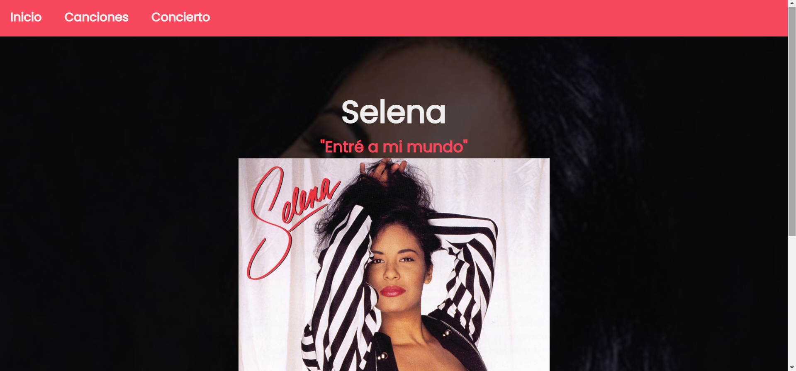

![Contributors][contributors-shield] ![License][license-shield]

	
	<h1 align="center"> Selena Quintanilla </h1>
	
 "La meta no es vivir para siempre, sino crear algo que sea eterno" 

## Proyecto

Sitio web acerca del álbum "Entré a mi vida" de Selena (1992) y su último concierto en el Astrodome.

[Hecha con fines educativos para una evaluación]

### - Javier Mejía

<!-- Declaraciones -->
[contributors-shield]: https://img.shields.io/github/contributors/Javithor360/selena.svg?style=for-the-badge
[license-shield]: https://img.shields.io/github/license/Javithor360/selena.svg?style=for-the-badge
